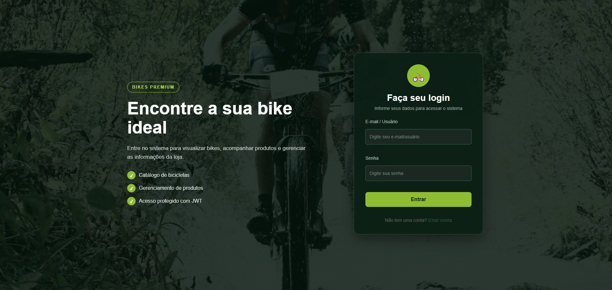
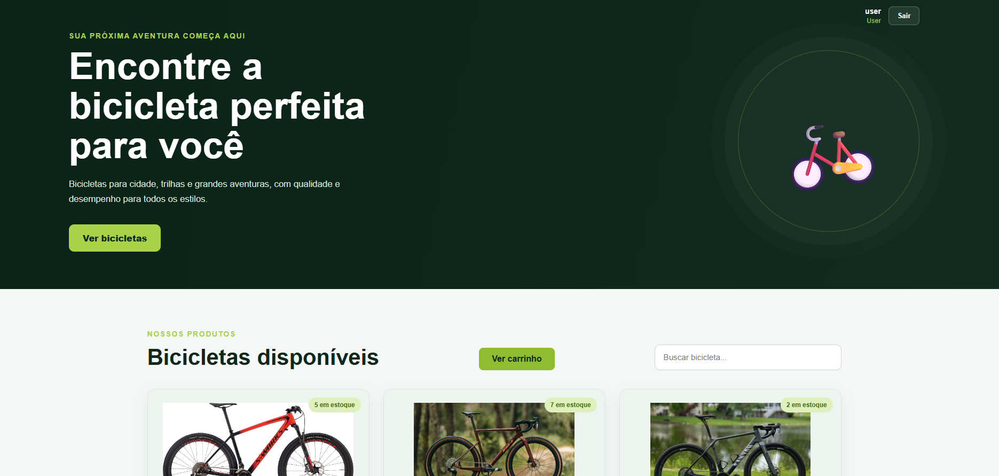
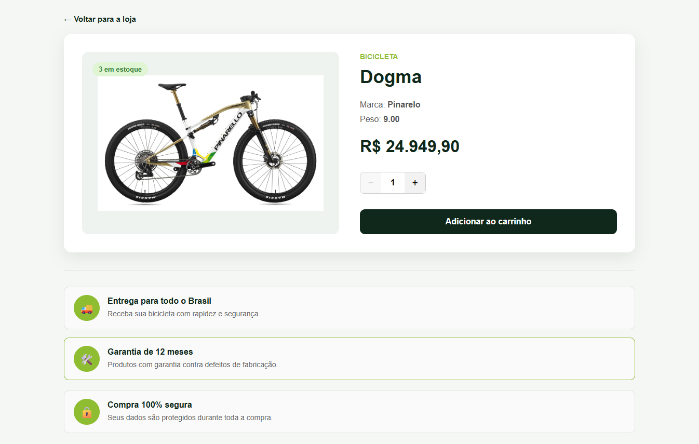
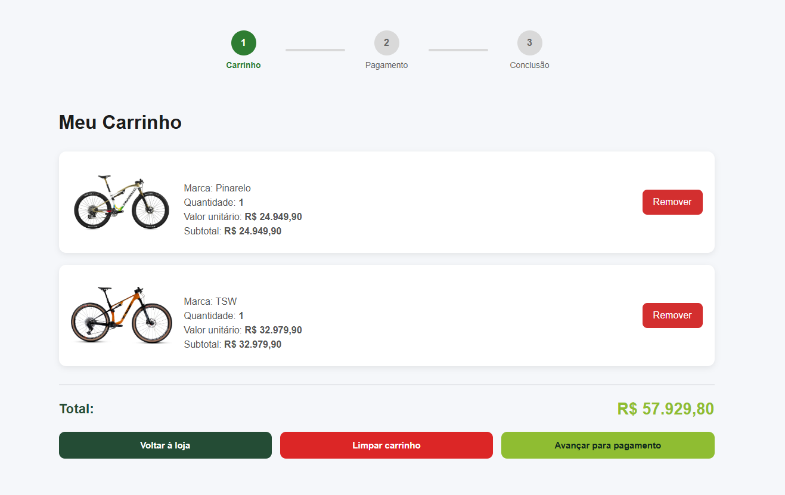
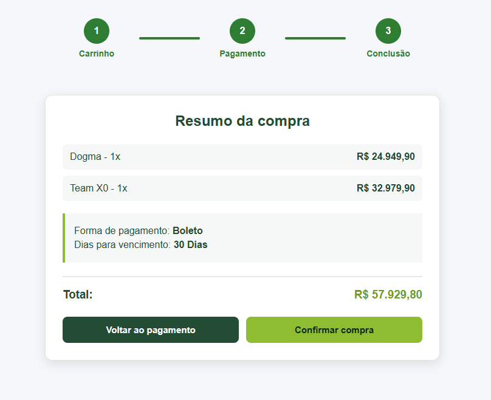
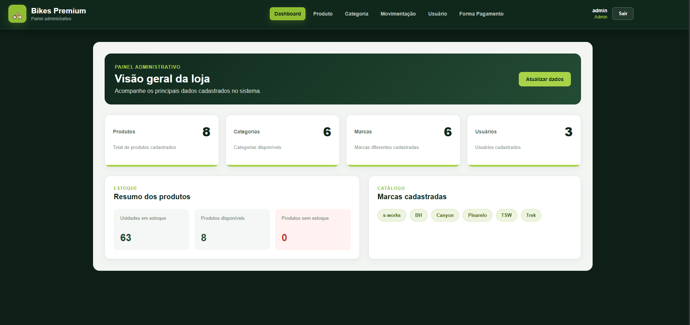

# 🚲 Bikes Premium

<p align="center">
Sistema Full Stack desenvolvido para gerenciamento e venda de motocicletas, contendo área administrativa e área do cliente, com autenticação JWT, controle de estoque e gerenciamento completo de produtos.
</p>

---

# 📸 Demonstração

## Tela de Login



---

## Loja



---

## Página de Detalhes



---

## Carrinho




---

## Checkout



---

## Painel Administrativo



---

# 🚀 Funcionalidades

## 👤 Autenticação

- Login de usuários
- Autenticação utilizando JWT
- Controle de permissões (Administrador e Cliente)
- Rotas protegidas
- Middleware de validação do Token

---

## 🛠 Área Administrativa

### Dashboard

- Painel administrativo

### Usuários

- Cadastro
- Listagem
- Controle de permissões

### Categorias

- Cadastro
- Edição
- Exclusão
- Validação de produtos vinculados

### Produtos

- Cadastro
- Edição
- Exclusão
- Controle de estoque
- Associação com categorias

### Movimentações

- Entrada de estoque
- Saída de estoque
- Atualização automática do estoque

### Formas de Pagamento

- Cadastro
- Exclusão
- Ativação/Inativação
- Controle de parcelamento

---

## 🛒 Área do Cliente

- Visualização dos produtos
- Busca de produtos
- Página de detalhes
- Carrinho de compras
- Escolha da forma de pagamento
- Parcelamento
- Finalização da compra
- Geração de comprovante

---

# ⚙️ Tecnologias

## Front-end

- React
- React Router DOM
- Vite
- CSS

## Back-end

- Node.js
- Express
- Sequelize
- MySQL
- JWT
- bcrypt
- dotenv
- cors

---

# 📂 Estrutura do Projeto

```text
Motorcycle
│
├── FrontEnd
│   ├── src
│   │
│   ├── components
│   ├── hooks
│   ├── assets
│   ├── pages
│   └── contexts
│
└── BackEnd
    ├── controllers
    ├── middleware
    ├── models
    ├── routes
    └── db
```

---

# 🗄 Modelagem do Banco de Dados

O banco foi desenvolvido utilizando **MySQL** e **Sequelize ORM**, explorando relacionamentos entre entidades para representar um sistema de gerenciamento de motocicletas.

## Entidades

### Usuário

Responsável pela autenticação do sistema.

- Nome
- Email
- Senha
- Role (Administrador ou Cliente)

---

### Categoria

Agrupa os produtos.

Exemplo:

- Esportivas
- Naked
- Big Trail
- Scooter

---

### Produto

Representa as motocicletas cadastradas.

- Nome
- Marca
- Peso
- Preço
- Estoque
- Imagem
- Categoria

---

### Movimentação

Controla toda entrada e saída de estoque.

---

### Forma de Pagamento

Define as formas disponíveis no checkout.

- Pix
- Crédito
- Débito
- Dinheiro
- Boleto

---

# 📋 Regras de Negócio

- Não é permitido excluir categorias com produtos vinculados.
- O estoque é atualizado automaticamente após cada movimentação.
- Não é permitido realizar saída maior que o estoque disponível.
- Apenas usuários autenticados podem acessar rotas protegidas.
- Apenas administradores possuem acesso ao painel administrativo.
- Apenas formas de pagamento ativas aparecem no checkout.
- O sistema gera um comprovante da compra ao finalizar o pedido.

---

# 🔐 Autenticação

O sistema utiliza **JWT (JSON Web Token)**.

Fluxo da autenticação:

```text
Login
   │
   ▼
Validação do usuário
   │
   ▼
Geração do Token JWT
   │
   ▼
Front-end armazena Token
   │
   ▼
Middleware verifica Token
   │
   ▼
Acesso liberado
```

---

# 📌 Funcionalidades implementadas

- ✅ Login
- ✅ JWT
- ✅ Rotas protegidas
- ✅ CRUD Usuários
- ✅ CRUD Categorias
- ✅ CRUD Produtos
- ✅ CRUD Movimentações
- ✅ CRUD Formas de Pagamento
- ✅ Controle de Estoque
- ✅ Carrinho
- ✅ Checkout
- ✅ Geração de comprovante

---

# 🎯 Objetivo

Este projeto foi desenvolvido para praticar conceitos de desenvolvimento Full Stack utilizando React e Node.js.

Durante o desenvolvimento foram aplicados conceitos como:

- Arquitetura MVC
- React Router
- Context API
- Hooks
- API REST
- Sequelize ORM
- Relacionamentos entre tabelas
- Middleware
- JWT
- Controle de estoque
- Organização de projeto
- Boas práticas de desenvolvimento

---

# 👨‍💻 Autor

**Cauã Ricken**


